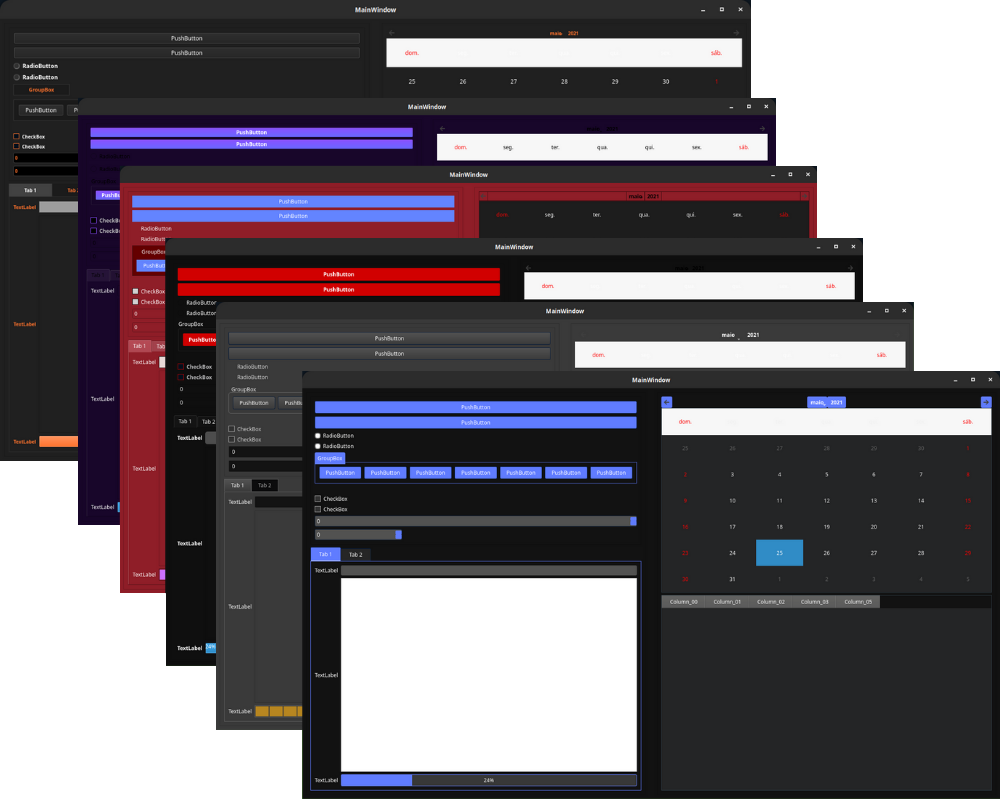
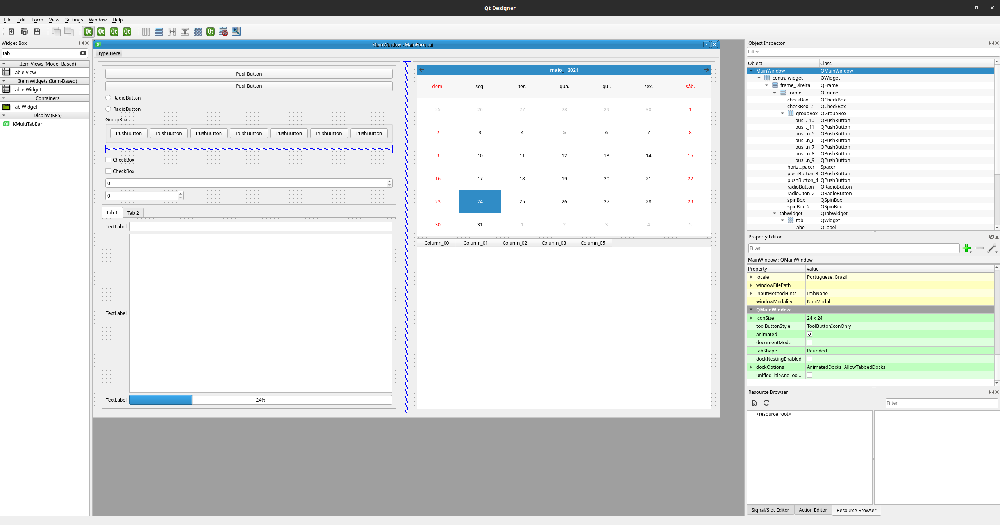
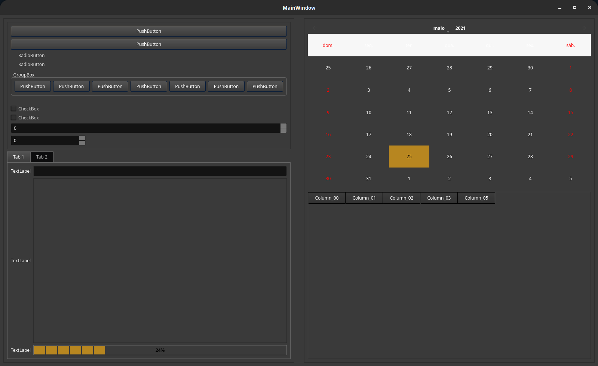
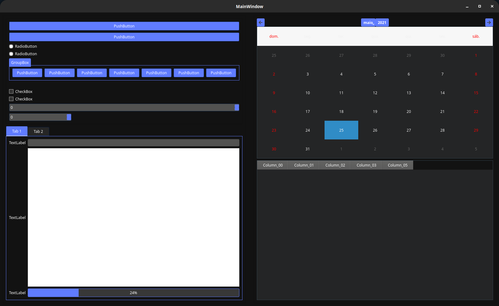
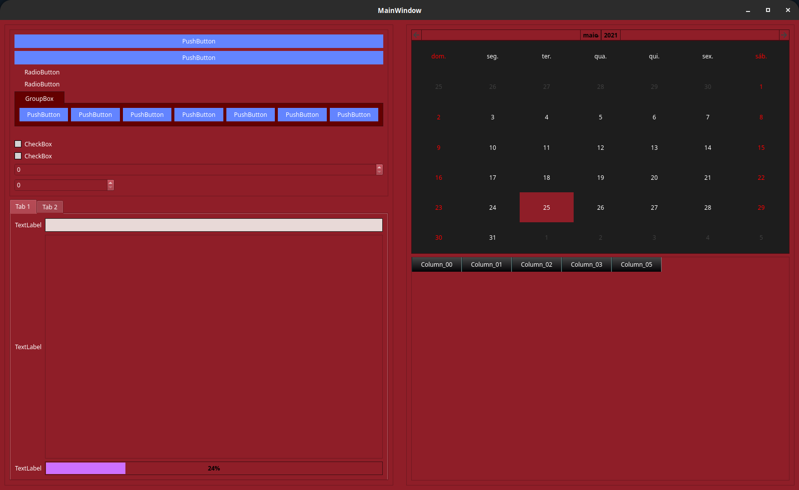
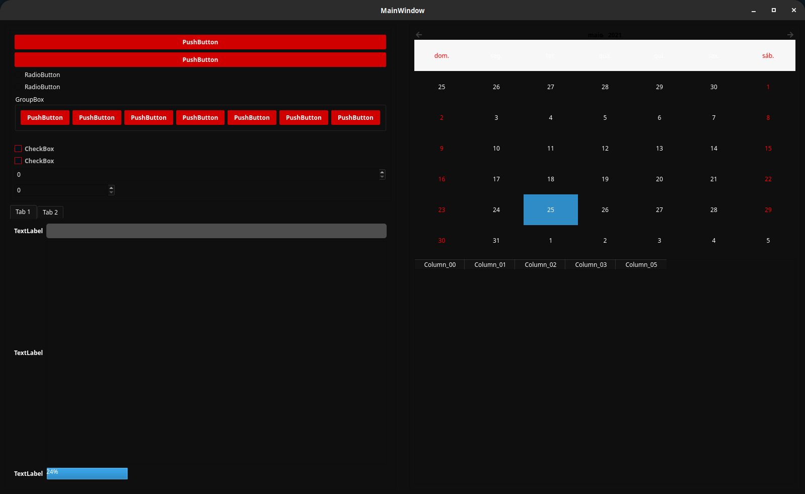
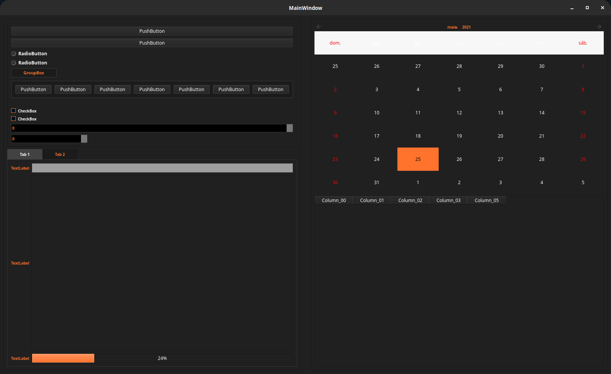
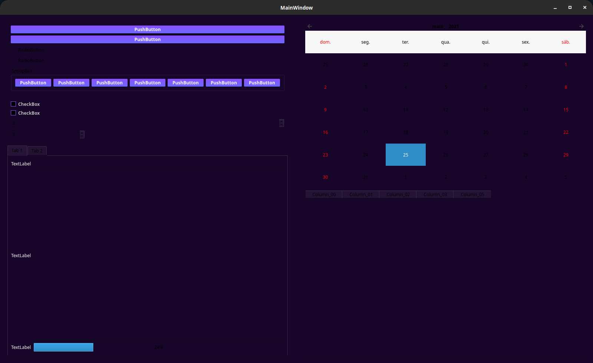

# Personalização de Forms Python


Projeto visando auxiliar programadores Python na personalização de Forms feitos com biblioteca QT.
Esse projeto demonstra diversos temas e o uso de arquivos ```.qss```.

## .qss Extensão de arquivo

Arquivo de folha de estilo usado pelos programas Qt contém definições para a aparência dos elementos GUI, incluindo fontes, tamanhos, cores, layouts e comportamentos de mouse; armazena uma biblioteca de estilos que podem ser incorporados em uma interface de usuário.
Os arquivos QSS são semelhantes aos arquivos ```.css``` . Eles podem ser criados com qualquer editor de texto


[]()
[]()
[](https://www.python.org/)
[](https://pypi.org/project/PySide2/)
[](https://pypi.org/project/PyQt5/)
[](https://doc.qt.io/qt-5/qtdesigner-manual.html)

## Installation
Use the package manager [pip](https://pip.pypa.io/en/stable/).
#### Pip

```properties
pip install PyQt5
pip install PySide2
```

#### Run
```properties
python main.py
```

## QT Designer
QT Designer é uma ```Qt-Tool``` para projetar e construir interfaces gráficas de usuário (GUIs) com ```Qt Widgets```. Você pode compor e personalizar seus forms.

```properties
Ubuntu: sudo apt install qttools5-dev
Fedora: sudo dnf install qt5-qttools qt5-designer
Windows: python -m pip install pyqt5-tools
```


## Arquivo no formato QT Designer

```properties
form_qt_designer/
└── MainForm.ui
```


## Temas usados no projeto
```properties
├── Combinear
│   └── theme.qss
├── Darkeum
│   └── theme.qss
├── Fibers
│   └── theme.qss
├── Fibrary
│   └── theme.qss
├── Genetive
│   └── theme.qss
└── Wstartpage
    └── theme.qss
```

### Tema Combinear

> Arquivo tema: [themes/Combinear/theme.qss](themes/Combinear/theme.qss)
### Tema Darkeum

> Arquivo tema: [themes/Darkeum/theme.qss](themes/Darkeum/theme.qss)
### Tema Fibers

> Arquivo tema: [themes/Fibers/theme.qss](themes/Fibers/theme.qss)
### Tema Fibrary

> Arquivo tema: [themes/Fibrary/theme.qss](themes/Fibrary/theme.qss)
### Tema Genetive

> Arquivo tema: [themes/Genetive/theme.qss](themes/Genetive/theme.qss)
### Tema Wstartpage

> Arquivo tema: [themes/Wstartpage/theme.qss](themes/Wstartpage/theme.qss)


## Tree
```properties
.
├── form_qt_designer
│   └── MainForm.ui
├── main.py
├── README.md
├── screenshot
│   ├── banner.png
│   ├── Combinear.png
│   ├── Darkeum.png
│   ├── Fibers.png
│   ├── Fibrary.png
│   ├── Genetive.png
│   ├── qt.png
│   └── Wstartpage.png
├── themes
│   ├── Combinear
│   │   ├── Combinear.png
│   │   ├── License.txt
│   │   └── theme.qss
│   ├── Darkeum
│   │   ├── Darkeum.png
│   │   ├── License.txt
│   │   └── theme.qss
│   ├── Fibers
│   │   ├── Fibers.png
│   │   ├── License.txt
│   │   └── theme.qss
│   ├── Fibrary
│   │   ├── Fibrary.png
│   │   ├── License.txt
│   │   └── theme.qss
│   ├── Genetive
│   │   ├── Genetive.png
│   │   ├── License.txt
│   │   └── theme.qss
│   └── Wstartpage
│       ├── License.txt
│       ├── theme.qss
│       └── Wstartpage.png
└── ui_MainForm.py
```

## Ref.
- https://doc.qt.io/qt-5/qtdesigner-manual.html
- https://qss-stock.devsecstudio.com/templates.php
- https://doc.qt.io/archives/qt-4.8/stylesheet-examples.html
- https://doc.qt.io/qt-5/stylesheet-reference.html
- https://doc.qt.io/qt-5/qcalendarwidget.html
- https://filememo.info/extension/qss
- https://pypi.org/project/PySide2/
